

<h1 align="center">  《麻省理工公开课：线性代数》中文笔记</h1>

  	
  
  
   	
  	
    
     

  <a href="https://github.com/MLNLP-World/MIT-Linear-Algebra-Notes#-%E9%A1%B9%E7%9B%AE%E5%8A%A8%E6%9C%BA">项目动机</a>/
  <a href="https://github.com/MLNLP-World/MIT-Linear-Algebra-Notes#-%E8%AF%BE%E7%A8%8B%E7%AE%80%E4%BB%8B">课程简介</a>/
  <a href="https://github.com/MLNLP-World/MIT-Linear-Algebra-Notes#-%E8%AF%BE%E7%A8%8B%E8%B5%84%E6%BA%90">课程资源</a>/
  <a href="https://github.com/MLNLP-World/MIT-Linear-Algebra-Notes#-%E7%AC%94%E8%AE%B0">笔记</a>/
  <a href="https://github.com/MLNLP-World/MIT-Linear-Algebra-Notes#-%E7%BB%84%E7%BB%87%E8%80%85">组织者</a>/
  <a href="https://github.com/MLNLP-World/MIT-Linear-Algebra-Notes#-%E8%B4%A1%E7%8C%AE%E8%80%85">贡献者</a>

---

##  项目动机

《麻省理工公开课：线性代数》是麻省理工公开课中广为流传的一门好课。本项目总结了我们在学习MIT线性代数课程 [Linear Algebra](http://open.163.com/special/opencourse/daishu.html)的学习笔记。赠人玫瑰，手留余香，我们将所有的笔记开源，希望在自己学习的同时，也对大家学习掌握《麻省理工公开课：线性代数》有所帮助。

>本项目的特色：
>
>1. **笔记**与**原课程视频**一一对应，可以帮助大家一边听课一边理解。
>2. 通过**图解**来使得笔记尽量通俗易懂

课程视频共35节，单个视频平均时长不超过60分钟，预计一个月可以学习完毕。

本项目所用徽章来自互联网，如侵犯了您的图片版权请联系我们删除，谢谢。
并且由于我们的水平有限，有任何问题和错误请批评指正，谢谢。

##  课程简介

课程介绍：“线性代数”，同微积分一样，是高等数学中两大入门课程之一，不仅是一门非常好的数学课程，也是一门非常好的工具学科，在很多领域都有广泛的用途。它的研究对象是向量，向量空间（或称线性空间），线性变换和有限维的线性方程组。本课程讲述了矩阵理论及线性代数的基本知识，侧重于那些与其他学科相关的内容，包括方程组、向量空间、行列式、特征值、相似矩阵及正定矩阵。

##  课程资源

- 网易公开课网址：[麻省理工公开课：线性代数](https://open.163.com/newview/movie/courseintro?newurl=%2Fspecial%2Fopencourse%2Fdaishu.html)

##  笔记
| 章节                             | 视频                                                         | 笔记                                                         |
| :------------------------------------- | :----------------------------------------------------------- | :----------------------------------------------------------- |
| 第一课：方程组的几何解释               | <a href="http://open.163.com/newview/movie/free?pid=M6V0BQC4M&mid=M6V29E773">  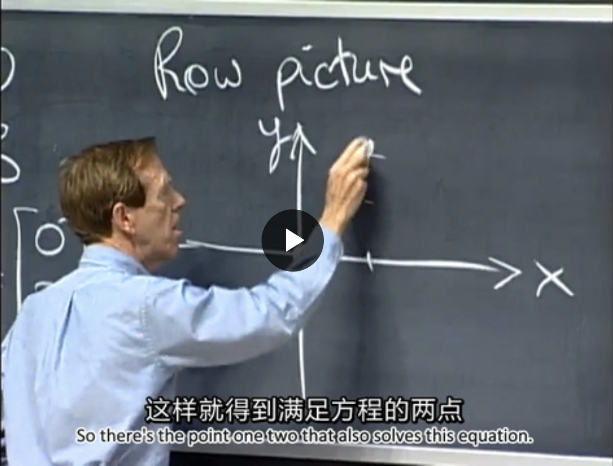</a> | [方程组的几何解释](https://github.com/ML-NLPChina/MIT-Linear-Algebra-Notes/blob/master/%5B01%5D%E6%96%B9%E7%A8%8B%E7%BB%84%E7%9A%84%E5%87%A0%E4%BD%95%E8%A7%A3%E9%87%8A/%E7%BA%BF%E6%80%A7%E4%BB%A3%E6%95%B0%5B%E4%B8%80%5D.pdf) |
| 第二课：矩阵消元                       | <a href="http://open.163.com/newview/movie/free?pid=M6V0BQC4M&mid=M6V29EGPP">  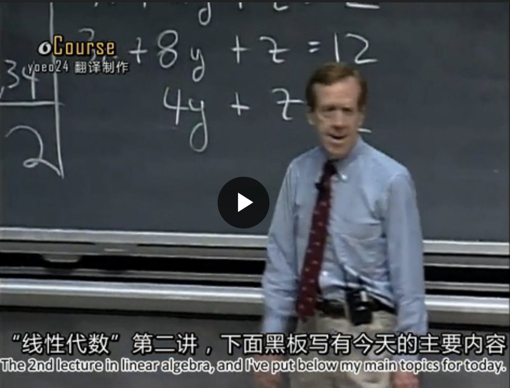</a> | [矩阵消元](https://github.com/ML-NLPChina/MIT-Linear-Algebra-Notes/blob/master/%5B02%5D%E7%9F%A9%E9%98%B5%E6%B6%88%E5%85%83/%E7%BA%BF%E6%80%A7%E4%BB%A3%E6%95%B0%5B%E4%BA%8C%5D.pdf) |
| 第三课：乘法和逆矩阵                   | <a href="http://open.163.com/newview/movie/free?pid=M6V0BQC4M&mid=M6V29FCHO">  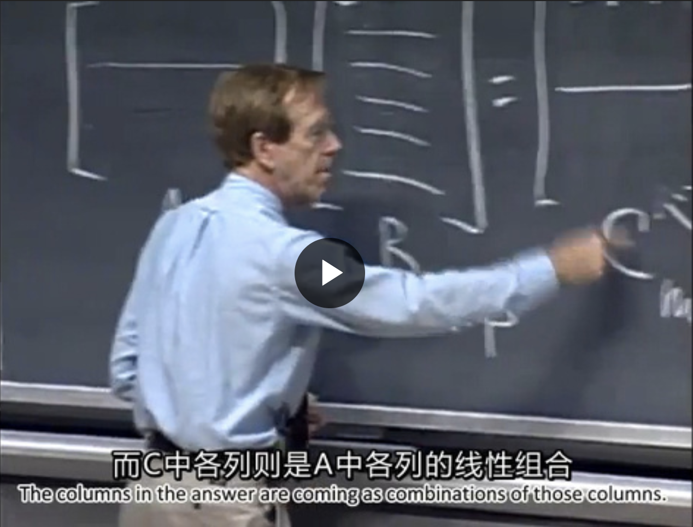</a> | [乘法和逆矩阵](https://github.com/ML-NLPChina/MIT-Linear-Algebra-Notes/blob/master/%5B03%5D%E4%B9%98%E6%B3%95%E5%92%8C%E9%80%86%E7%9F%A9%E9%98%B5/%E7%BA%BF%E6%80%A7%E4%BB%A3%E6%95%B0%5B%E4%B8%89%5D.pdf) |
| 第四课：A 的 LU 分解                   |  | [A 的 LU 分解](https://github.com/ML-NLPChina/MIT-Linear-Algebra-Notes/blob/master/%5B04%5DA%20%E7%9A%84%20LU%20%E5%88%86%E8%A7%A3/%E7%BA%BF%E6%80%A7%E4%BB%A3%E6%95%B0%5B%E5%9B%9B%5D.pdf) |
| 第五课：转置-置换-向量空间R            | <a href="https://open.163.com/newview/movie/free?pid=M6V0BQC4M&mid=M6V29FRJK">  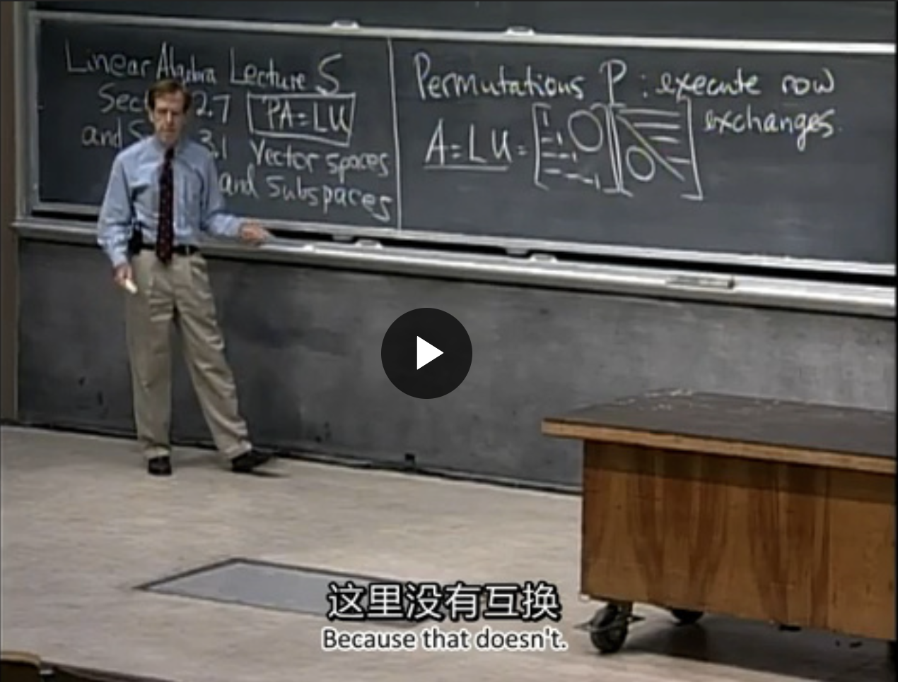</a> | [转置-置换-向量空间R](https://github.com/ML-NLPChina/MIT-Linear-Algebra-Notes/blob/master/%5B05%5D%20%E8%BD%AC%E7%BD%AE-%E8%BD%AC%E6%8D%A2-%E5%90%91%E9%87%8F%E7%A9%BA%E9%97%B4%20R/%E7%BA%BF%E6%80%A7%E4%BB%A3%E6%95%B0%5B%E4%BA%94%5D.pdf) |
| 第六课：列空间与零空间                 | <a href="https://open.163.com/newview/movie/free?pid=M6V0BQC4M&mid=M6V2AB1B5">  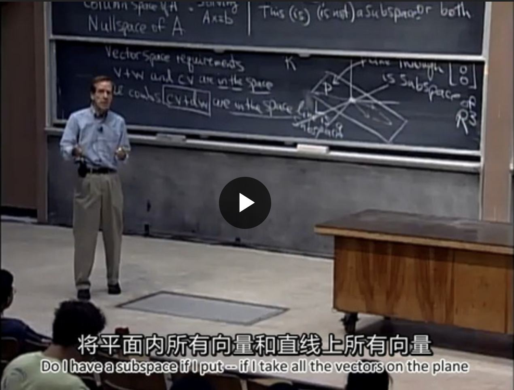</a> | [列空间与零空间](https://github.com/ML-NLPChina/MIT-Linear-Algebra-Notes/blob/master/%5B06%5D%20%E5%88%97%E7%A9%BA%E9%97%B4%E5%92%8C%E9%9B%B6%E7%A9%BA%E9%97%B4/%E5%88%97%E7%A9%BA%E9%97%B4%E5%92%8C%E9%9B%B6%E7%A9%BA%E9%97%B4.pdf) |
| 第七课：求解 Ax = 0，主变量，特解      |  | [求解 Ax = 0，主变量，特解](https://github.com/ML-NLPChina/MIT-Linear-Algebra-Notes/blob/master/%5B07%5D%20%E6%B1%82%E8%A7%A3%20Ax%20%3D%200%EF%BC%8C%E4%B8%BB%E5%8F%98%E9%87%8F%EF%BC%8C%E7%89%B9%E8%A7%A3/%E7%BA%BF%E6%80%A7%E4%BB%A3%E6%95%B0%5B%E4%B8%83%5D.pdf) |
| 第八课：求解Ax=b：可解性和解的结构     | <a href="https://open.163.com/newview/movie/free?pid=M6V0BQC4M&mid=M6V2ABHV8">  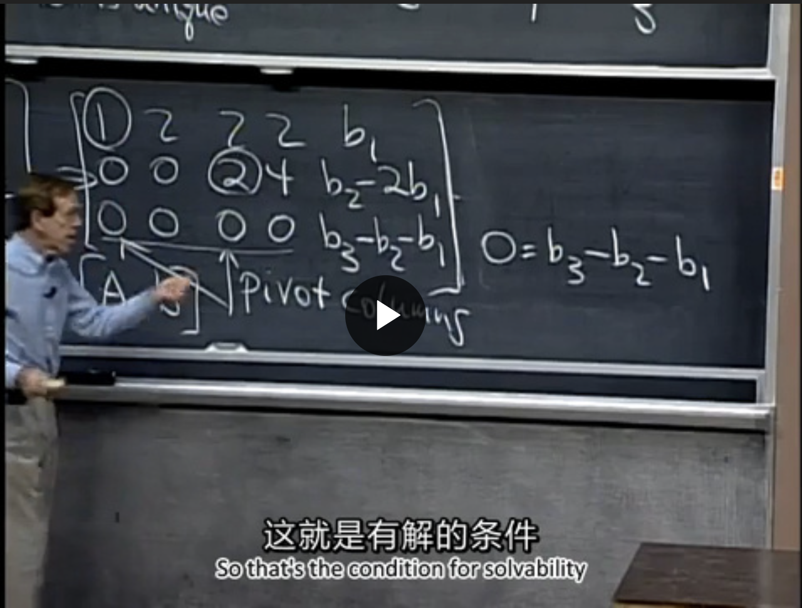</a> | [求解Ax=b：可解性和解的结构](https://github.com/ML-NLPChina/MIT-Linear-Algebra-Notes/blob/master/%5B08%5D%20Ax%3Db%20%E7%9A%84%E5%8F%AF%E8%A7%A3%E6%80%A7%E5%92%8C%E8%A7%A3%E7%9A%84%E7%BB%93%E6%9E%84/%E7%BA%BF%E6%80%A7%E4%BB%A3%E6%95%B08.pdf) |
| 第九课：线性相关性、基、维数           |  | [线性相关性、基、维数](https://github.com/ML-NLPChina/MIT-Linear-Algebra-Notes/blob/master/%5B09%5D%20%E7%BA%BF%E6%80%A7%E7%9B%B8%E5%85%B3%E6%80%A7%EF%BC%8C%E5%9F%BA%EF%BC%8C%E7%BB%B4%E6%95%B0/%E7%BA%BF%E6%80%A7%E4%BB%A3%E6%95%B09.pdf) |
| 第十课：四个基本子空间                 | <a href="https://open.163.com/newview/movie/free?pid=M6V0BQC4M&mid=M6V2ADFDT"> 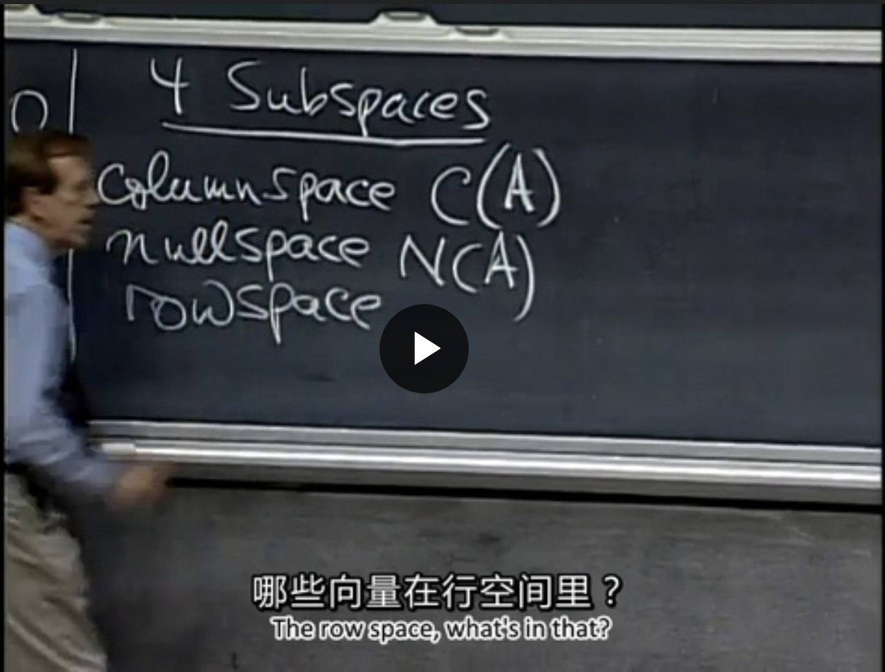</a> | [四个基本子空间](https://github.com/ML-NLPChina/MIT-Linear-Algebra-Notes/blob/master/%5B10%5D%20%E5%9B%9B%E4%B8%AA%E5%9F%BA%E6%9C%AC%E5%AD%90%E7%A9%BA%E9%97%B4/%E7%BA%BF%E6%80%A7%E4%BB%A3%E6%95%B010.pdf) |
| 第十一课：矩阵空间、秩1矩阵和小世界图  | <a href="https://open.163.com/newview/movie/free?pid=M6V0BQC4M&mid=M6V2AJS2T">  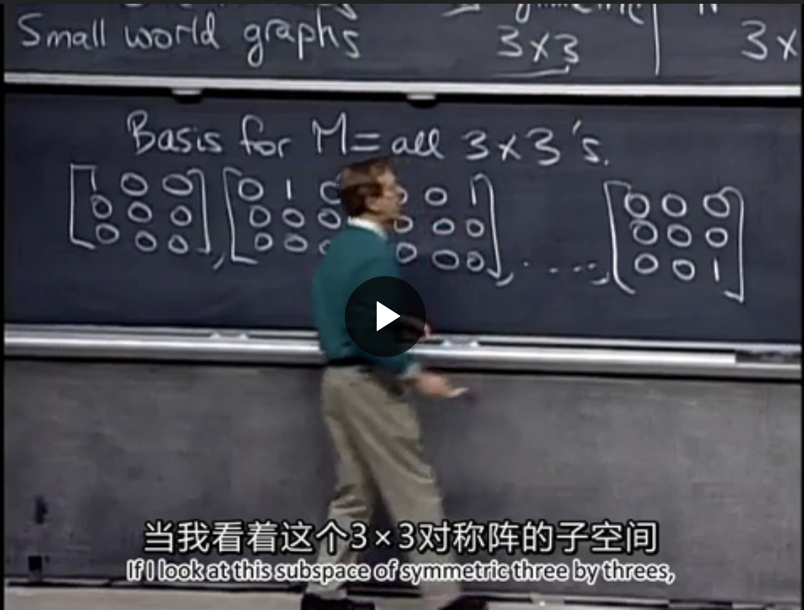</a> | [矩阵空间、秩1矩阵和小世界图](https://github.com/ML-NLPChina/MIT-Linear-Algebra-Notes/blob/master/%5B11%5D%20%E7%9F%A9%E9%98%B5%E7%A9%BA%E9%97%B4%20%E7%A7%A91%20%E7%9F%A9%E9%98%B5/%E7%BA%BF%E6%80%A7%E4%BB%A3%E6%95%B011.pdf) |
| 第十二课：图和网络                     | <a href="https://open.163.com/newview/movie/free?pid=M6V0BQC4M&mid=M6V2AIUTE">  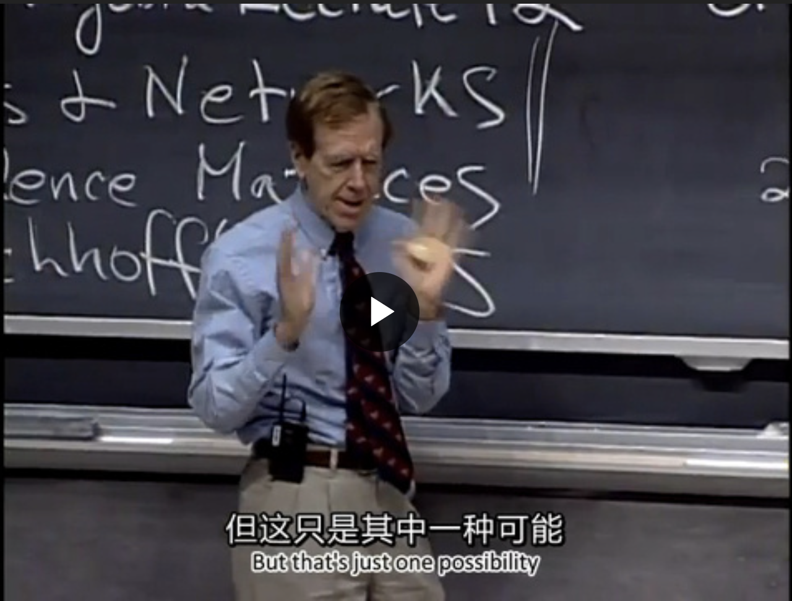</a> | [图和网络](https://github.com/ML-NLPChina/MIT-Linear-Algebra-Notes/blob/master/%5B12%5D%20%E7%9F%A9%E9%98%B5%E5%BA%94%E7%94%A8%EF%BC%9A%E5%9B%BE%E4%B8%8E%E7%BD%91%E7%BB%9C/%E7%BA%BF%E6%80%A7%E4%BB%A3%E6%95%B012.pdf) |
| 第十三课：复习一                       | <a href="https://open.163.com/newview/movie/free?pid=M6V0BQC4M&mid=M6V2AJ69K">  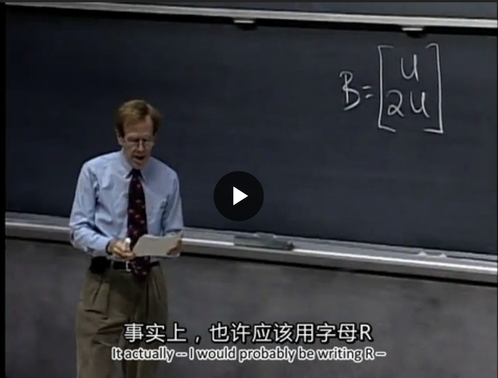</a> | [复习一](https://github.com/ML-NLPChina/MIT-Linear-Algebra-Notes/blob/master/%5B13%5D%20%E5%A4%8D%E4%B9%A0%E4%B8%80/%E7%BA%BF%E6%80%A7%E4%BB%A3%E6%95%B013.pdf) |
| 第十四课：正交向量与子空间             | <a href="https://open.163.com/newview/movie/free?pid=M6V0BQC4M&mid=M6V2AJEMH">  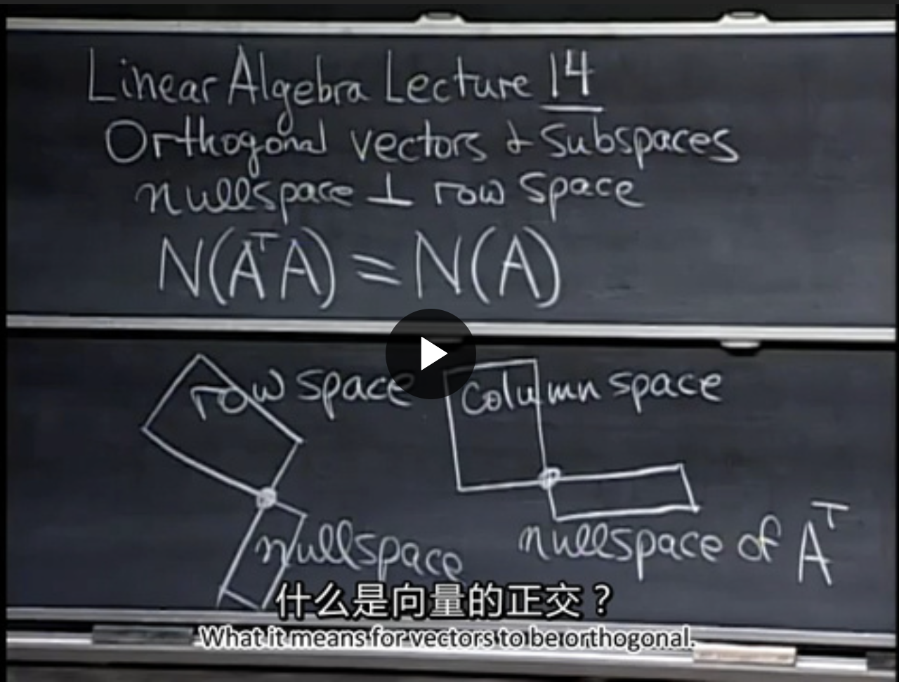</a> | [正交向量与子空间](https://github.com/ML-NLPChina/MIT-Linear-Algebra-Notes/blob/master/%5B14%5D%20%E6%AD%A3%E4%BA%A4%E5%90%91%E9%87%8F%E4%B8%8E%E5%AD%90%E7%A9%BA%E9%97%B4/%E7%BA%BF%E6%80%A7%E4%BB%A3%E6%95%B014.pdf) |
| 第十五课：子空间投影                   | <a href="https://open.163.com/newview/movie/free?pid=M6V0BQC4M&mid=M6V2AJLJU">  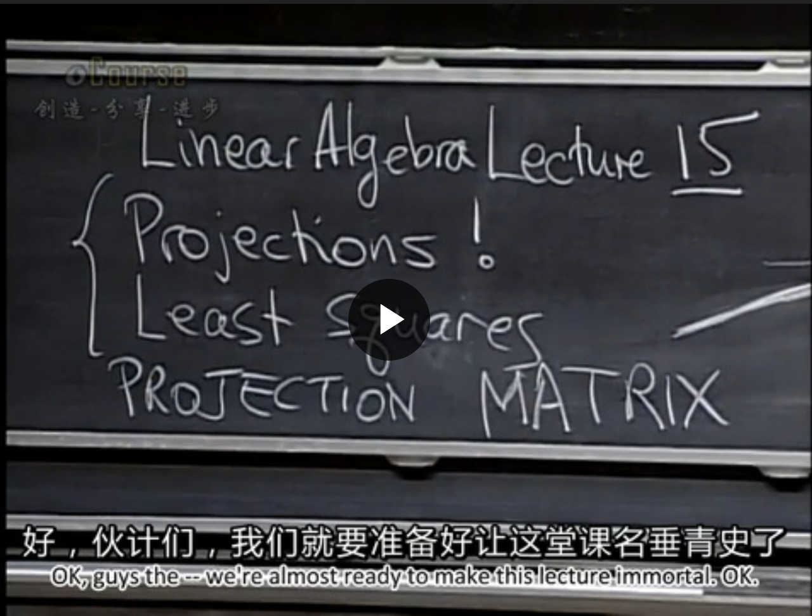</a> | [子空间投影](https://github.com/ML-NLPChina/MIT-Linear-Algebra-Notes/blob/master/%5B15%5D%20%E5%AD%90%E7%A9%BA%E9%97%B4%E6%8A%95%E5%BD%B1/%E7%BA%BF%E6%80%A7%E4%BB%A3%E6%95%B015.pdf) |
| 第十六课：投影矩阵和最小二乘           | <a href="https://open.163.com/newview/movie/free?pid=M6V0BQC4M&mid=M6V2AOJPU">  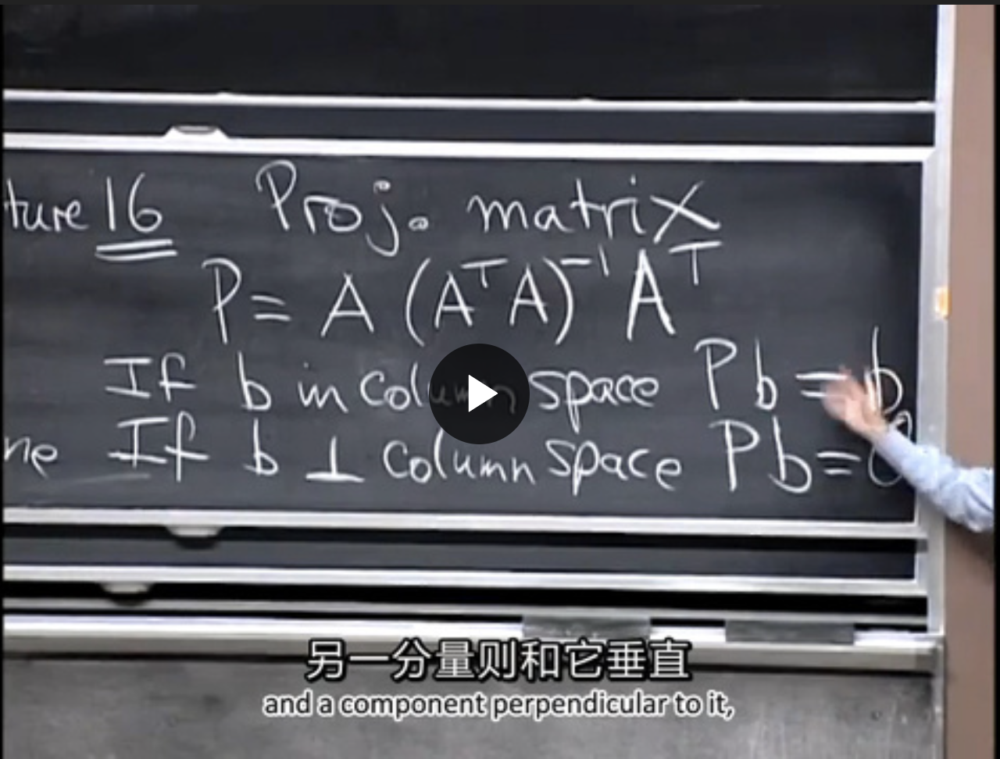</a> | [投影矩阵和最小二乘](https://github.com/ML-NLPChina/MIT-Linear-Algebra-Notes/blob/master/%5B16%5D%20%E6%8A%95%E5%BD%B1%E7%9F%A9%E9%98%B5%E5%92%8C%E6%9C%80%E5%B0%8F%E4%BA%8C%E4%B9%98/%E7%BA%BF%E6%80%A7%E4%BB%A3%E6%95%B016.pdf) |
| 第十七课：正交矩阵和Gram-Schmidt正交化 | <a href="https://open.163.com/newview/movie/free?pid=M6V0BQC4M&mid=M6V2AORLS">  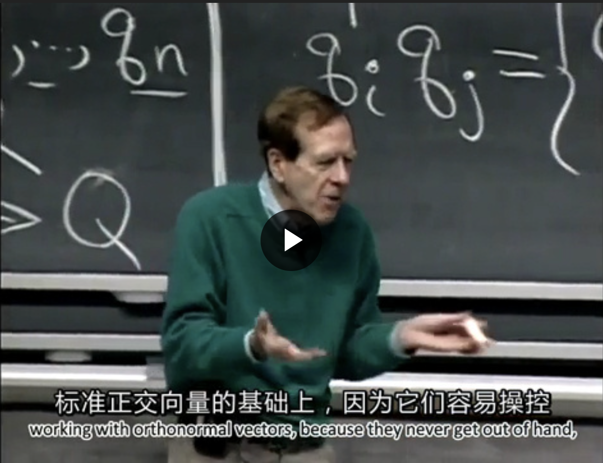</a> | [正交矩阵和Gram-Schmidt正交化](https://github.com/ML-NLPChina/MIT-Linear-Algebra-Notes/blob/master/%5B17%5D%20%E6%AD%A3%E4%BA%A4%E7%9F%A9%E9%98%B5%E5%92%8CGram-Schmidt%20%E6%AD%A3%E4%BA%A4%E5%8C%96/%E7%BA%BF%E6%80%A7%E4%BB%A3%E6%95%B017.pdf) |
| 第十八课：行列式介绍1          | <a href="https://open.163.com/newview/movie/free?pid=M6V0BQC4M&mid=M6V2AP150">  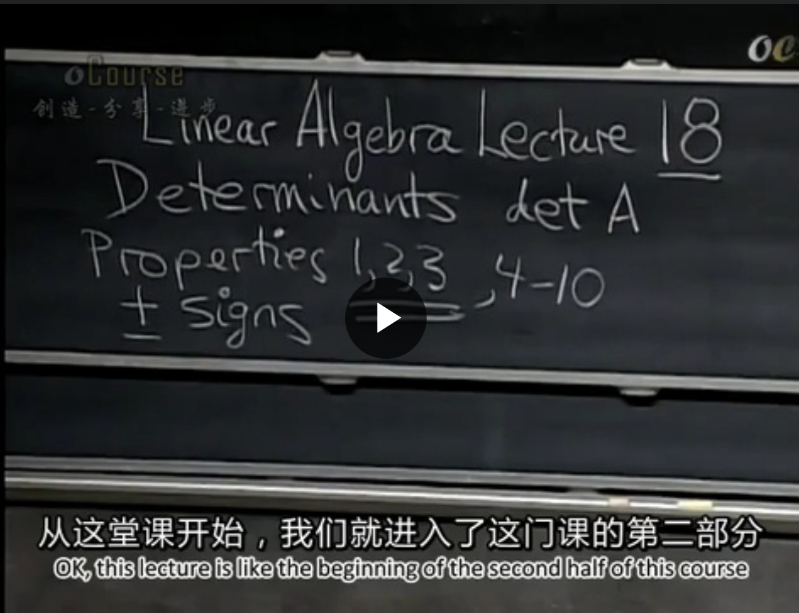</a> | [行列式介绍](https://github.com/ML-NLPChina/MIT-Linear-Algebra-Notes/blob/master/%5B18%2C19%5D%20%E8%A1%8C%E5%88%97%E5%BC%8F%E4%BB%8B%E7%BB%8D/%E7%BA%BF%E6%80%A7%E4%BB%A3%E6%95%B018%2C19.pdf) |
| 第十九课：行列式介绍2 | <a href="https://open.163.com/newview/movie/free?pid=M6V0BQC4M&mid=M6V2APP34">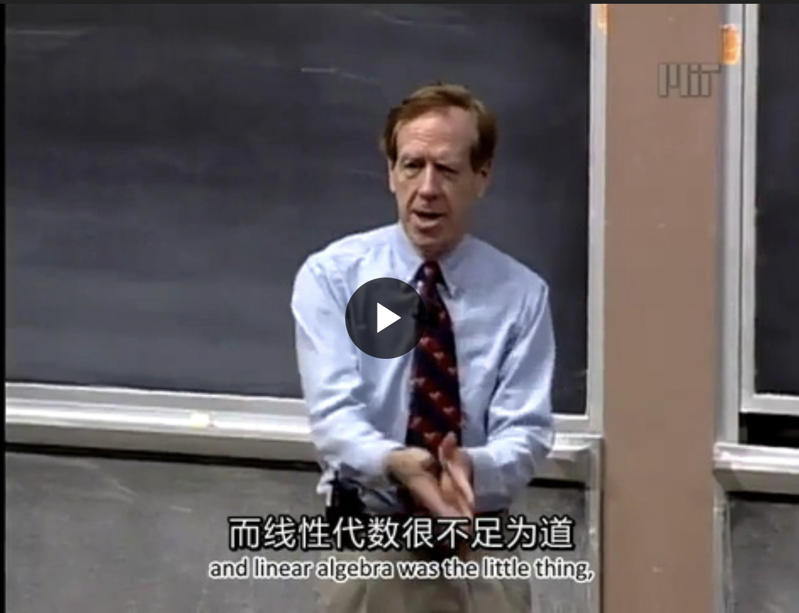</a> | [行列式介绍](https://github.com/ML-NLPChina/MIT-Linear-Algebra-Notes/blob/master/%5B18%2C19%5D%20%E8%A1%8C%E5%88%97%E5%BC%8F%E4%BB%8B%E7%BB%8D/%E7%BA%BF%E6%80%A7%E4%BB%A3%E6%95%B018%2C19.pdf) |
| 第二十课：克拉默法则、逆矩阵、体积     | <a href="https://open.163.com/newview/movie/free?pid=M6V0BQC4M&mid=M6V2AQ40C">  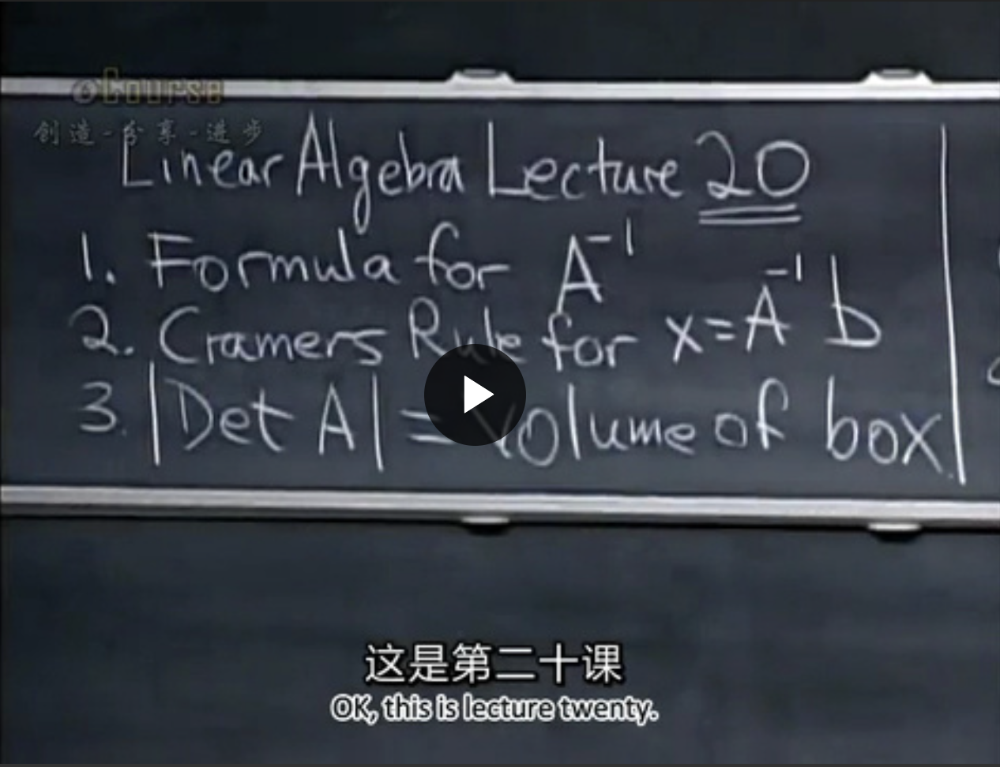</a> | [克拉默法则、逆矩阵、体积](https://github.com/ML-NLPChina/MIT-Linear-Algebra-Notes/blob/master/%5B20%5D%20%E5%85%8B%E8%8E%B1%E5%A7%86%E6%B3%95%E5%88%99%E3%80%81%E9%80%86%E7%9F%A9%E9%98%B5%E3%80%81%E4%BD%93%E7%A7%AF/%E7%BA%BF%E6%80%A7%E4%BB%A3%E6%95%B020.pdf) |
| 第二十一课：特征值和特征向量           | <a href="https://open.163.com/newview/movie/free?pid=M6V0BQC4M&mid=M6V2AV2R8">  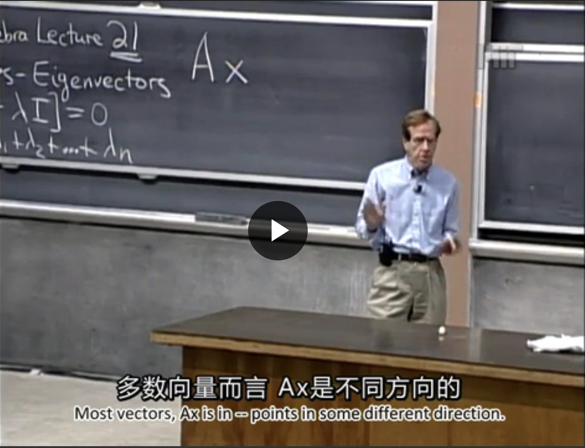</a> | [特征值和特征向量](https://github.com/ML-NLPChina/MIT-Linear-Algebra-Notes/blob/master/%5B21%5D%20%E7%89%B9%E5%BE%81%E5%80%BC%E5%92%8C%E7%89%B9%E5%BE%81%E5%90%91%E9%87%8F/%E7%BA%BF%E6%80%A7%E4%BB%A3%E6%95%B021.pdf) |
| 第二十二课：对角化和 A 的幂            | <a href="https://open.163.com/newview/movie/free?pid=M6V0BQC4M&mid=M6V2AV6GL">  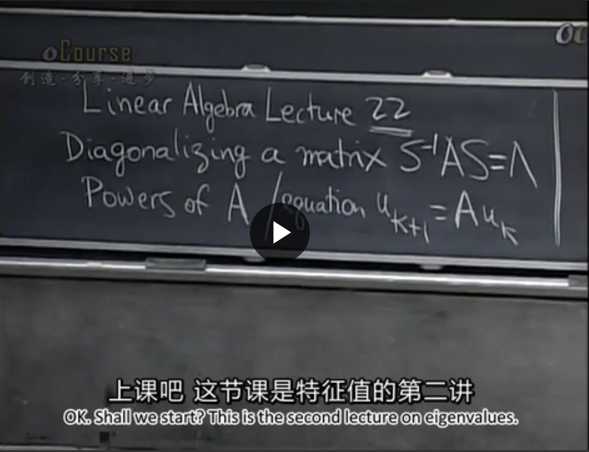</a> | [对角化和 A 的幂](https://github.com/ML-NLPChina/MIT-Linear-Algebra-Notes/blob/master/%5B22%5D%20%E5%AF%B9%E8%A7%92%E5%8C%96%E5%92%8C%20A%20%E7%9A%84%E5%B9%82/%E7%BA%BF%E6%80%A7%E4%BB%A3%E6%95%B022.pdf) |
| 第二十三课：微分方程和exp(At)          | <a href="https://open.163.com/newview/movie/free?pid=M6V0BQC4M&mid=M6V2AVIBM">  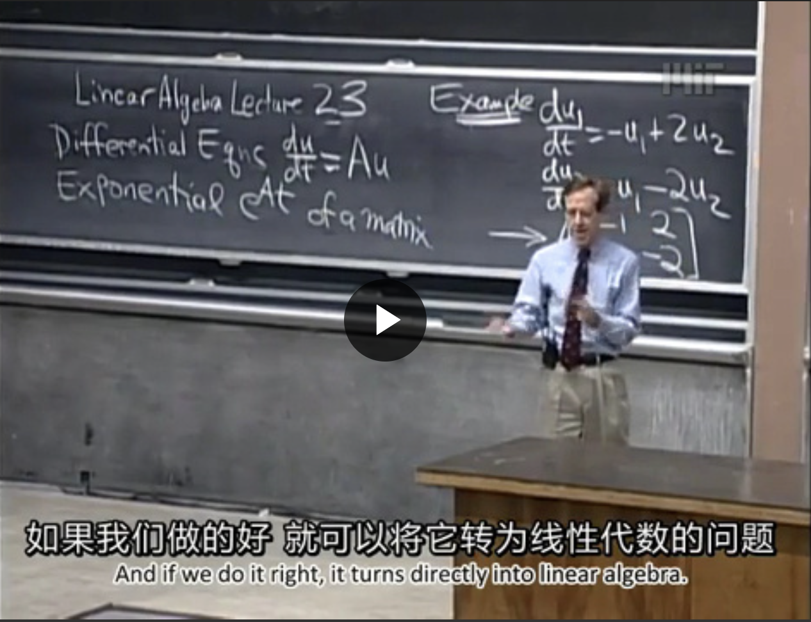</a> | [微分方程和exp(At)](https://github.com/ML-NLPChina/MIT-Linear-Algebra-Notes/blob/master/%5B23%5D%20%E5%BE%AE%E5%88%86%E6%96%B9%E7%A8%8B%E5%92%8Cexp(At)/%E7%BA%BF%E6%80%A7%E4%BB%A3%E6%95%B023.pdf) |
| 第二十四课：马尔可夫矩阵;傅立叶级数    | <a href="https://open.163.com/newview/movie/free?pid=M6V0BQC4M&mid=M6V2AVOAV">  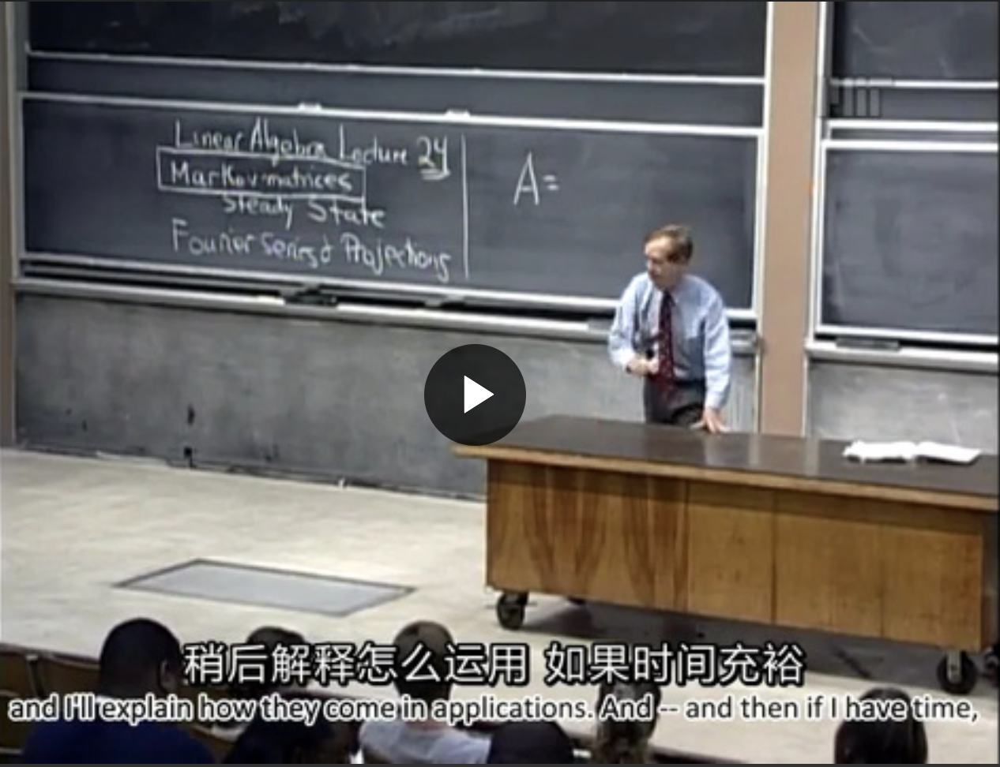</a> | [马尔可夫矩阵;傅立叶级数](https://github.com/ML-NLPChina/MIT-Linear-Algebra-Notes/blob/master/%5B24%5D%20%E9%A9%AC%E5%B0%94%E5%8F%AF%E5%A4%AB%E7%9F%A9%E9%98%B5%3B.%E5%82%85%E7%AB%8B%E5%8F%B6%E7%BA%A7%E6%95%B0/%E7%BA%BF%E6%80%A7%E4%BB%A3%E6%95%B024.pdf) |
| 第二十五课：复习二                     | <a href="https://open.163.com/newview/movie/free?pid=M6V0BQC4M&mid=M7E4C9V6P">  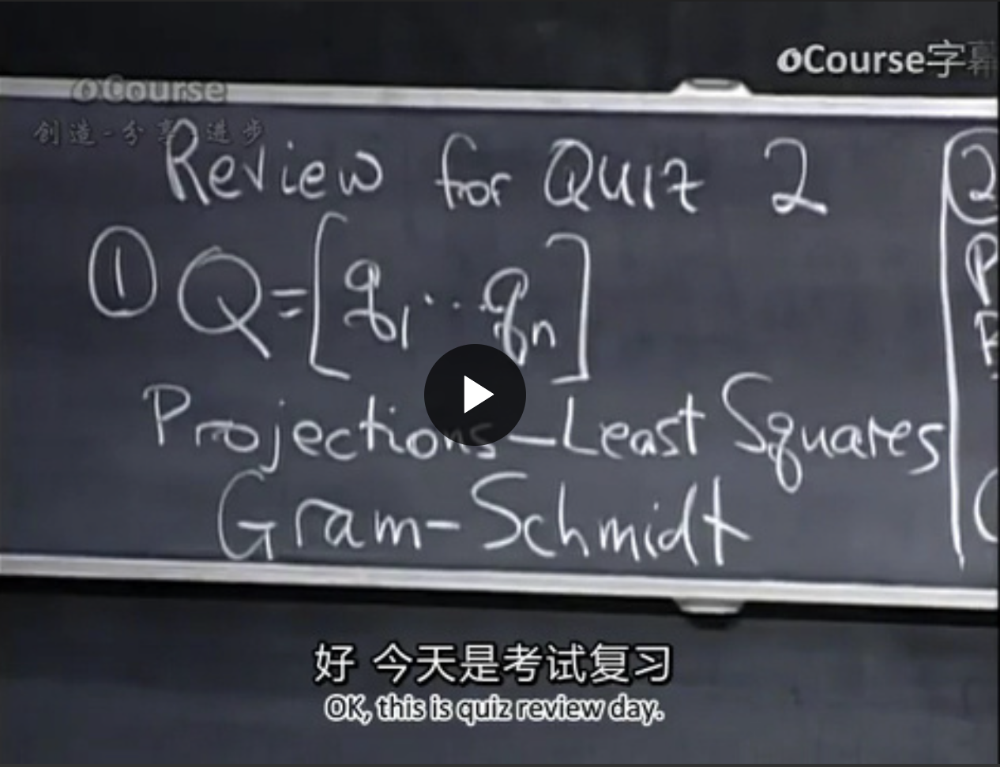</a> | [复习二](https://github.com/ML-NLPChina/MIT-Linear-Algebra-Notes/blob/master/%5B25%5D%20%E5%A4%8D%E4%B9%A0%E4%BA%8C/%E7%BA%BF%E6%80%A7%E4%BB%A3%E6%95%B025.pdf) |
| 第二十六课：对称矩阵及正定性           | <a href="https://open.163.com/newview/movie/free?pid=M6V0BQC4M&mid=M6V2AVUL4">  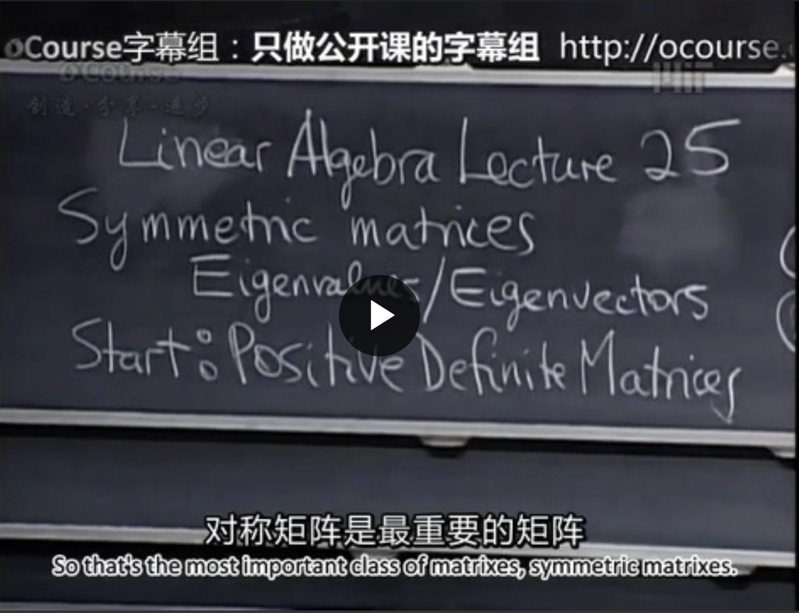</a> | [对称矩阵及正定性](https://github.com/ML-NLPChina/MIT-Linear-Algebra-Notes/blob/master/%5B26%5D%20%E5%AF%B9%E7%A7%B0%E7%9F%A9%E9%98%B5%E5%8F%8A%E6%AD%A3%E5%AE%9A%E6%80%A7/%E7%BA%BF%E6%80%A7%E4%BB%A3%E6%95%B026.pdf) |
| 第二十七课：复数矩阵和快速傅里叶变换   | <a href="https://open.163.com/newview/movie/free?pid=M6V0BQC4M&mid=M6V2B4U77">  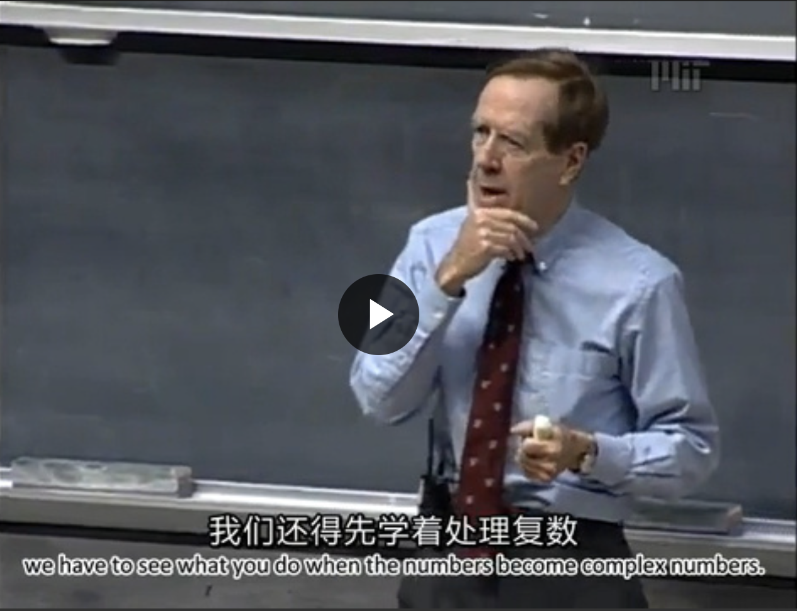</a> | [复数矩阵和快速傅里叶变换](https://github.com/ML-NLPChina/MIT-Linear-Algebra-Notes/blob/master/%5B27%5D%20%E5%A4%8D%E6%95%B0%E7%9F%A9%E9%98%B5%E5%92%8C%E5%BF%AB%E9%80%9F%E5%82%85%E9%87%8C%E5%8F%B6%E5%8F%98%E6%8D%A2/%E7%BA%BF%E6%80%A7%E4%BB%A3%E6%95%B027.pdf) |
| 第二十八课：正定矩阵和最小值           | <a href="https://open.163.com/newview/movie/free?pid=M6V0BQC4M&mid=M6V2B5J3P">  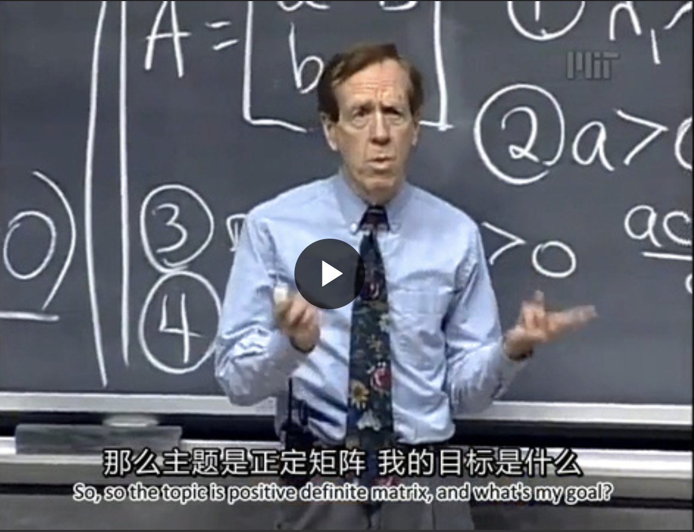</a> | [正定矩阵和最小值](https://github.com/ML-NLPChina/MIT-Linear-Algebra-Notes/blob/master/%5B28%5D%20%E6%AD%A3%E5%AE%9A%E7%9F%A9%E9%98%B5%E5%92%8C%E6%9C%80%E5%B0%8F%E5%80%BC/%E7%BA%BF%E6%80%A7%E4%BB%A3%E6%95%B028.pdf) |
| 第二十九课：相似矩阵和若尔当形         | <a href="https://open.163.com/newview/movie/free?pid=M6V0BQC4M&mid=M6V2B5OKE">  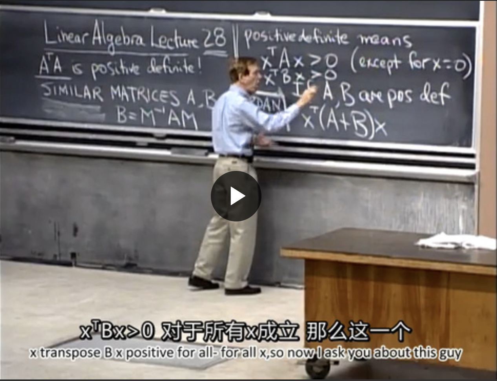</a> | [相似矩阵和若尔当形](https://github.com/ML-NLPChina/MIT-Linear-Algebra-Notes/blob/master/%5B29%5D%20%E7%9B%B8%E4%BC%BC%E7%9F%A9%E9%98%B5%E5%92%8C%E8%8B%A5%E5%B0%94%E5%BD%93%E5%BD%A2/%E7%BA%BF%E6%80%A7%E4%BB%A3%E6%95%B029.pdf) |
| 第三十课：奇异值分解                   | <a href="https://open.163.com/newview/movie/free?pid=M6V0BQC4M&mid=M6V2B5R1G">  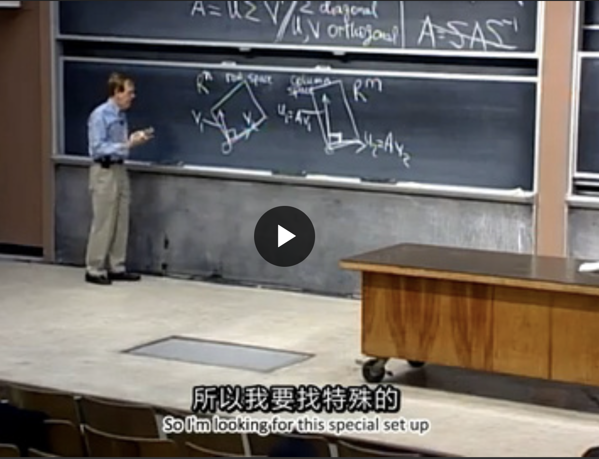</a> | [奇异值分解](https://github.com/ML-NLPChina/MIT-Linear-Algebra-Notes/blob/master/%5B30%5D%20%E5%A5%87%E5%BC%82%E5%80%BC%E5%88%86%E8%A7%A3/%E7%BA%BF%E6%80%A7%E4%BB%A3%E6%95%B030.pdf) |
| 第三十一课：线性变换及对应矩阵         | <a href="https://open.163.com/newview/movie/free?pid=M6V0BQC4M&mid=M6V2B60PJ">  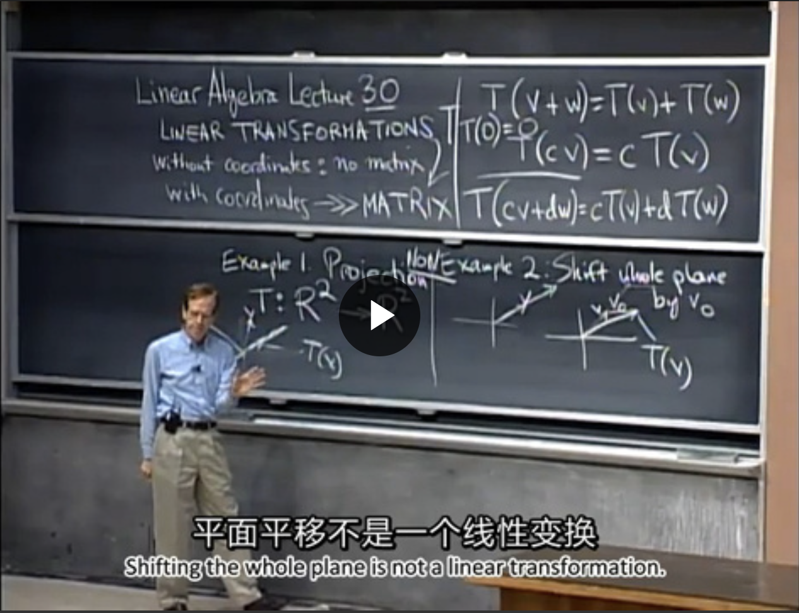</a> | [线性变换及对应矩阵](https://github.com/ML-NLPChina/MIT-Linear-Algebra-Notes/blob/master/%5B31%5D%20%E7%BA%BF%E6%80%A7%E5%8F%98%E6%8D%A2%E5%8F%8A%E5%AF%B9%E5%BA%94%E7%9F%A9%E9%98%B5/%E7%BA%BF%E6%80%A7%E4%BB%A3%E6%95%B031.pdf) |
| 第三十二课：基变换和图像压缩           | <a href="https://open.163.com/newview/movie/free?pid=M6V0BQC4M&mid=M6V2BA04Q">  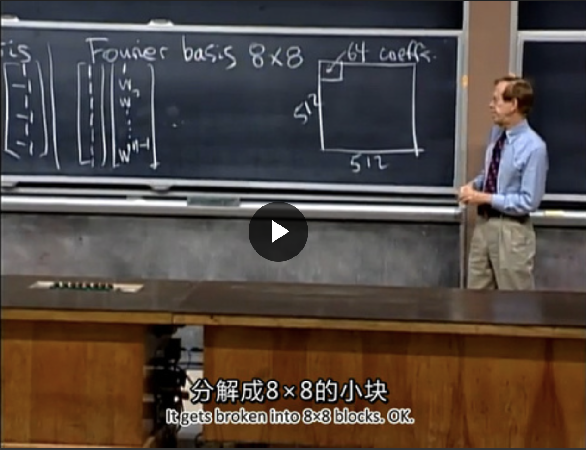</a> | [基变换和图像压缩](https://github.com/ML-NLPChina/MIT-Linear-Algebra-Notes/blob/master/%5B32%5D%20%E5%9F%BA%E5%8F%98%E6%8D%A2%E5%92%8C%E5%9B%BE%E5%83%8F%E5%8E%8B%E7%BC%A9/%E7%BA%BF%E6%80%A7%E4%BB%A3%E6%95%B032.pdf) |
| 第三十三课：单元检测3复习              | <a href="https://open.163.com/newview/movie/free?pid=M6V0BQC4M&mid=M6V2BA6N8">  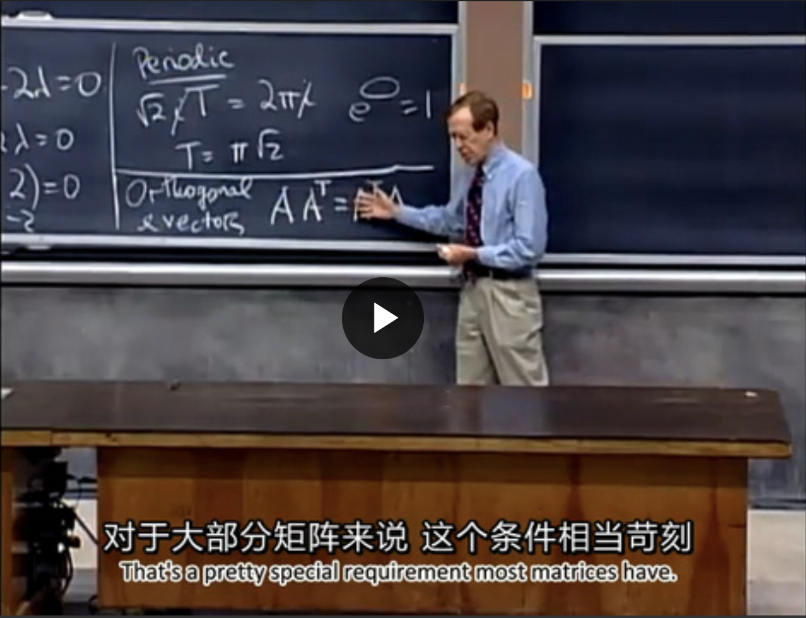</a> | [单元检测3复习](https://github.com/ML-NLPChina/MIT-Linear-Algebra-Notes/blob/master/%5B33%5D%20%E5%8D%95%E5%85%83%E6%A3%80%E6%B5%8B3%E5%A4%8D%E4%B9%A0/%E7%BA%BF%E6%80%A7%E4%BB%A3%E6%95%B033.pdf) |
| 第三十四课：左右逆和伪逆               | <a href="https://open.163.com/newview/movie/free?pid=M6V0BQC4M&mid=M6V2BADQ9">  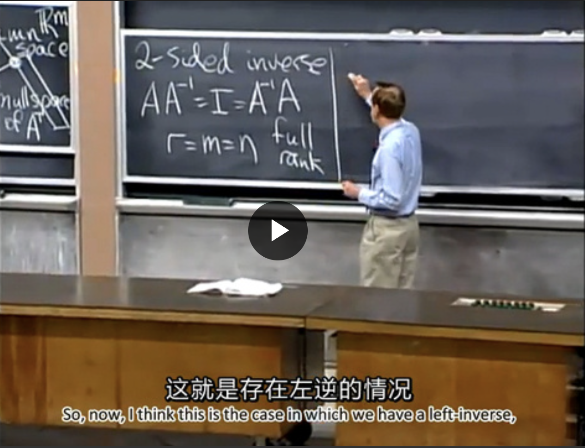</a> | [左右逆和伪逆](https://github.com/ML-NLPChina/MIT-Linear-Algebra-Notes/blob/master/%5B34%5D%20%E5%B7%A6%E5%8F%B3%E9%80%86%E5%92%8C%E4%BC%AA%E9%80%86/%E7%BA%BF%E6%80%A7%E4%BB%A3%E6%95%B034.pdf) |
| 第三十五课：期末复习                   | <a href="https://open.163.com/newview/movie/free?pid=M6V0BQC4M&mid=M6V2BAN1H">  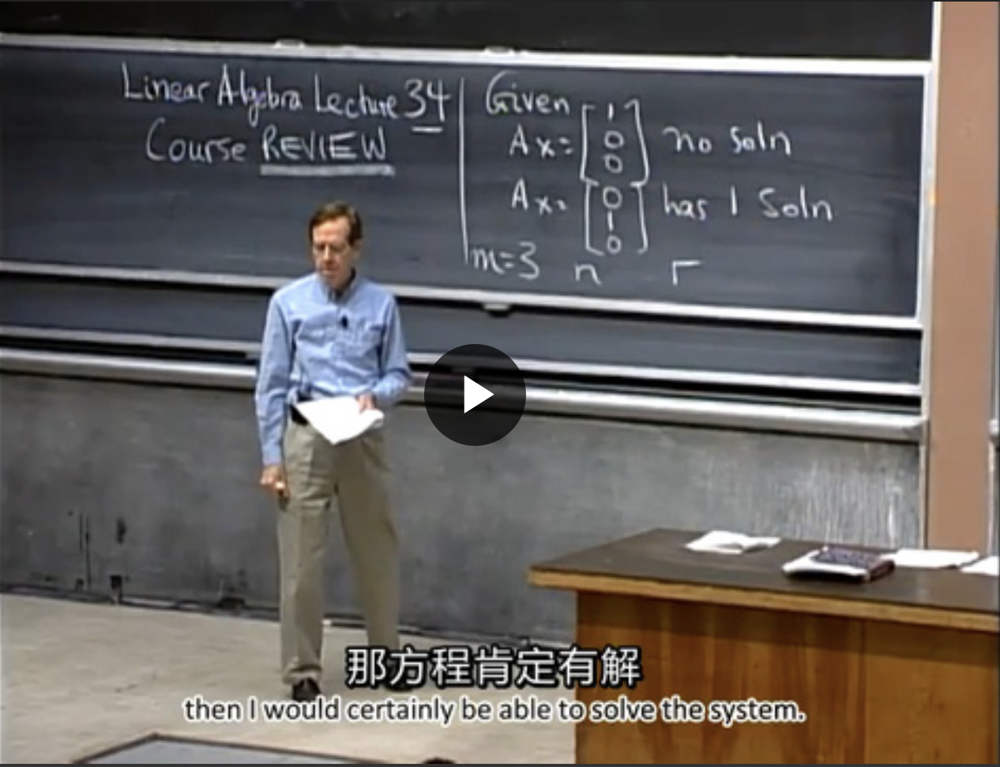</a> | [期末复习](https://github.com/ML-NLPChina/MIT-Linear-Algebra-Notes/blob/master/%5B35%5D%20%E6%9C%9F%E6%9C%AB%E5%A4%8D%E4%B9%A0/%E7%BA%BF%E6%80%A7%E4%BB%A3%E6%95%B035.pdf) |

##  组织者
感谢以下同学对本项目的组织

 

##  贡献者
感谢以下同学对本项目的支持与贡献

  

 

